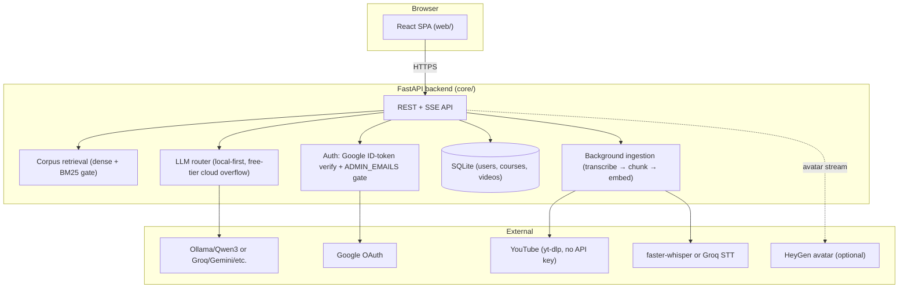
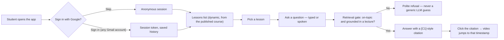
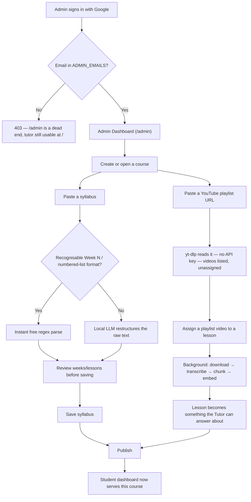

# Adaptive Tutor

A video-grounded, language-adaptive tutor. Students ask in **Egyptian Arabic, English, or
French** (typed or spoken); the tutor answers **only from the course's lecture videos**, links
every claim to a clickable timestamp, speaks the answer, and lip-syncs a 2D avatar. An
**Admin Dashboard** lets one authorized account author the syllabus and connect YouTube
playlists — students never touch that surface, and their own access needs no account at all.

```
web/        Vite + React SPA                          ← student dashboard, admin dashboard, player, chat, voice, avatar
core/       FastAPI (Python)                           ← retrieval, LLM router, auth, admin API, STT/TTS, SQLite
pipeline/   video → transcript → chunks → embeddings   ← batch ingest for the static/curated corpus
corpus/     git-versioned index shards + transcripts   ← one shard per video
eval/       Q&A eval set per language + gate script    ← run before raising any quality baseline
deploy/     systemd unit + Caddyfile + bootstrap script ← for a $0 Oracle Cloud Always Free VM
```

## Architecture



## Run locally (5 minutes)

```bash
# 1. core
python -m venv core/.venv && core/.venv/Scripts/pip install -r core/requirements.txt
cp core/.env.example core/.env          # every key is optional — see the comments in the file
python pipeline/ingest.py               # indexes pipeline/videos.yaml (sample lectures included)
cd core && .venv/Scripts/python -m uvicorn app.main:app --port 8000

# 2. web
cd web && npm i && npm run dev          # http://localhost:5173
```

With no keys at all, the tutor still answers — from the exact lecture passage, with a
timestamp — instead of a generated answer. `python -m app.cli doctor` (from `core/`) reports
what's configured and what isn't.

## Who can do what

There is no enrollment/invite step for students and exactly one way to become an admin:

- **Students**: open the app and start asking questions — no account needed. Signing in with
  **any Google account** is optional and only unlocks saved chat history across devices; it
  grants no extra access.
- **Admin**: `/admin` requires Google Sign-In *and* the signed-in email must appear in
  `ADMIN_EMAILS` (a comma-separated allowlist in `core/.env`, checked fresh on every request —
  never cached in a token, never trusted from anything the browser sends). In this deployment
  that's a single address, `priyanvishnu800@gmail.com`. Every admin route independently
  enforces this server-side — a signed-in non-admin gets a `403` on all of them, proven by the
  security tests in `tests/test_course_admin_api.py`.





## Adding lecture content

Two independent ways in, both ending at the same place — a video the Tutor can cite:

- **Admin Dashboard** (`/admin`, requires sign-in as the allowlisted admin): paste a YouTube
  playlist link, map its videos to a syllabus you author or paste in, publish. Assigning a
  video kicks off transcription in the background automatically.
- **Static/curated corpus** (no admin account needed, for maintainers with repo access):
  `python pipeline/add_videos.py --dir <folder> --lang ar --week 1` registers clips into
  `pipeline/videos.yaml`, then `python pipeline/ingest.py` transcribes and indexes them. Put
  course jargon in `corpus/vocabulary.txt` — it primes Whisper and live speech-to-text.

*Bulk first ingest with a free GPU:* open a Kaggle notebook (GPU T4, 30 h/week), clone the
repo, `pip install -r pipeline/requirements.txt`, `WHISPER_MODEL=large-v3 WHISPER_DEVICE=cuda
python pipeline/ingest.py`, then commit `corpus/`.

*Transcript corrections:* edit `corpus/transcripts/<id>.vtt` (keep timestamps), set that
video's `transcript: file` + `transcript_file: corpus/transcripts/<id>.vtt` in
`pipeline/videos.yaml`, re-run `ingest.py`.

## Deploy ($0/month)

| Piece | Where | How |
|---|---|---|
| Web | Vercel / Cloudflare Pages | Root `web`, build `npm ci && npm run build`, output `dist`, env `VITE_API_URL=https://api.<domain>` |
| Core | Oracle Cloud Always Free (Ampere A1, up to 4 OCPU/24 GB, ARM) | `deploy/setup.sh` — installs Python, clones the repo, sets up a systemd service + Caddy (automatic HTTPS) |
| LLM/STT on a GPU-less box | Groq free tier | Set `GROQ_API_KEY` + `LOCAL_LLM_ENABLED=false` in `core/.env` — the embedding/retrieval lane stays local either way (CPU-friendly), only the LLM and STT move to Groq's cloud |

```bash
# On the Oracle VM, after cloning the repo:
bash deploy/setup.sh
# then follow the checklist it prints: fill core/.env, point your domain's A record at
# the VM, open the cloud firewall's 80/443, edit deploy/Caddyfile, start the services.
```

Update `ALLOWED_ORIGINS` in `core/.env` and the OAuth client's **Authorized JavaScript
origins** (Google Cloud Console) to include the deployed frontend's real URL — both are
exact-match checks, and skipping either breaks sign-in or gets requests blocked by CORS.

## LLM providers

All free tiers, all through their OpenAI-compatible endpoints, limits in
`core/providers.yaml`. Local Qwen3 via Ollama is preferred when available and needs no key;
`GEMINI_API_KEY`, `CEREBRAS_API_KEY`, `GROQ_API_KEY`, `MISTRAL_API_KEY`, `OPENROUTER_API_KEY`,
or `CLOUDFLARE_API_TOKEN`+`CLOUDFLARE_ACCOUNT_ID` are optional overflow, reached only when the
local server is down or saturated. `GROQ_API_KEY` also enables free Whisper-quality speech
input. With every key empty the tutor still works — it returns the exact lecture passage and
timestamp instead of a generated answer.

## Quality gate

`python eval/run_eval.py` — retrieval recall@5, citation@1, gate recall, language detection,
guard false-blocks, per language. CI fails below the baselines in the script; **raise a
baseline only with a real measurement that earns it**, never to make CI pass. Extend
`eval/qa_{ar,en,fr}.jsonl` with real course questions (gold = video id + timestamp window).

## Ops admin (separate from the course Admin Dashboard)

A second, older admin mechanism — a shared `ADMIN_TOKEN` in `core/.env`, sent as the
`x-admin-token` header — covers operational endpoints, not course authoring:

- `GET /admin/status` — provider budgets, queue depth, cache size, 24h event counts/latencies
- `POST /admin/reload` — hot-swap the corpus after a manual `pipeline/ingest.py` run

This is deliberately distinct from `/admin/course/*` (Google Sign-In + `ADMIN_EMAILS`): one is
an ops lever for whoever holds the token, the other is per-person identity for syllabus
authoring.

## Changing things with an AI

`CLAUDE.md` is read automatically by Claude Code sessions in this repo — read it before
touching `core/app/`, `providers.yaml`, or the voice path; each rule in it exists because it
was broken once, at cost. For any other AI, paste `docs/MASTER_PROMPT.md` and write the change
you want at the bottom of it.
