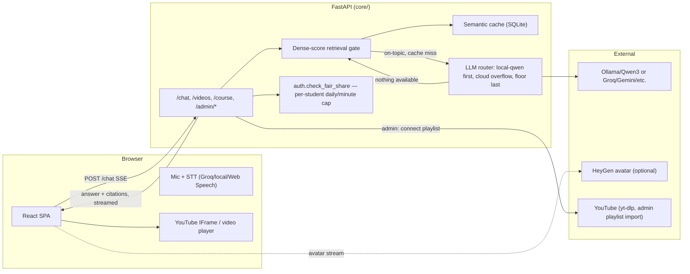

# Adaptive Tutor — Architecture

**Status:** reflects what is actually built and running, not a pre-launch proposal.
**Supersedes:** an earlier v1.0 design (3D avatar via three.js, a Cloudflare edge layer,
enrollment-code/SSO auth, Docker + Cloudflare Tunnel, Litestream/R2 backups, Grafana/Sentry
monitoring). None of that shipped — the system that got built is simpler on every one of
those axes, and this document describes that system, not the original pitch.

> **Scope statement.** This system is **language-adaptive** (Egyptian Arabic / English /
> French, detected per message) and **content-grounded** (answers only from the course's
> video transcripts, every claim cited to a timestamp). It is **not pedagogically
> adaptive** — no mastery tracking, no difficulty adjustment. Evaluate it against the four
> criteria below.

| # | Criterion | How it's actually met |
|---|---|---|
| 1 | **FAST** | Local Qwen3-8B (priority 1 in the router) answers in seconds on a GPU; free-tier cloud providers (Groq, Gemini, Cerebras, Mistral, Cloudflare Workers AI) are the overflow when local is down or saturated — not the primary path. |
| 2 | **FREE** | Every credential is optional except `LIVEAVATAR_API_KEY`, and only if the avatar is used at all. `tests/test_keyless_install.py` proves the whole app works with every key empty. The only real recurring cost is hosting (an Oracle Cloud Always Free VM is $0; a paid VPS is a few dollars/month) and, optionally, a domain. |
| 3 | **SPEAKING AVATAR** | A HeyGen LiveAvatar stream (sandbox mode: free, ~60s sessions, fixed demo avatar) with a local 2D viseme-driven fallback when the avatar is off or unavailable. Not the originally-planned client-rendered 3D GLB — HeyGen does the rendering server-side, over LiveKit. |
| 4 | **NO QUOTA** | No student ever sees a hard rate-limit error: a per-student daily/minute fair-share cap (`auth.check_fair_share`) throttles gracefully with a friendly message, and when no LLM is available the extractive floor (the actual cited lecture passage, no generation) always answers. |

---

## 1. What's actually running, component by component

| Component | What it is | Where |
|---|---|---|
| Frontend | Vite + React + TypeScript SPA, notebook/ruled-paper theme, streams answers over SSE | `web/`, deployed as a static site (Vercel or Cloudflare Pages) |
| Backend | FastAPI (Python), single process, SQLite (WAL mode) on local disk | `core/`, run directly via `uvicorn` under systemd — no Docker, no container layer |
| Retrieval | In-memory NumPy dense vectors (`intfloat/multilingual-e5-base`, 768-d) + BM25 (`bm25s`), fused, brute-force cosine — a course's corpus is small enough (thousands of chunks) that this needs no vector database | `core/app/corpus.py` |
| LLM | Budget-aware router: local Qwen3-8B via Ollama first (no key, no quota, no cap), free-tier cloud providers as overflow, an extractive-floor fallback with no LLM at all | `core/app/router.py`, `core/providers.yaml` |
| STT (voice in) | Groq Whisper if `GROQ_API_KEY` is set (free tier, best Egyptian accuracy) → local faster-whisper → the browser's own Web Speech API | `core/app/stt.py` |
| TTS (voice out) | Piper (VITS) voices run **server-side** per language, with Mishkal diacritizing Arabic text first so the MSA-trained voice doesn't mis-vowel it. (Not the originally-planned in-browser WASM synthesis — Piper runs on the backend and streams audio to the client.) | `core/app/tts.py` |
| Avatar | HeyGen LiveAvatar over LiveKit (sandbox = free, fixed avatar, ~60s cap; billed = a real key, any configured avatar/voice) | `core/app/liveavatar.py`, `web/src/components/LiveAvatarPanel.tsx` |
| Video playback | YouTube IFrame API directly (`controls=0`, custom chrome built by hand) for YouTube-sourced lectures, or a plain `<video>` element for locally-hosted files. Captions are the Tutor's own transcript overlay, not YouTube's — they carry the same timestamps as the citations. | `web/src/components/VideoPlayer.tsx` |
| Captions/subtitles | Always English or Arabic on screen, regardless of the video's real spoken language — translated once via the local LLM router and cached to disk per (video, language) | `core/app/captions_translate.py` |
| Auth | Google Sign-In (ID-token verified against Google's JWKS) is optional and only unlocks saved chat history — students are anonymous by default with no login step at all. A separate allowlist (`ADMIN_EMAILS`) gates the Admin Dashboard, checked fresh on every request. | `core/app/auth.py` |
| Course content | Admin-authored courses (weeks → lessons → a mapped video), connected to a YouTube playlist read via `yt-dlp` (no API key), with an AI-assisted syllabus parser as a fallback when pasted text isn't in a clean "Week N" format | `core/app/content.py`, `core/app/youtube.py`, `core/app/syllabus_ai.py`, `web/src/components/AdminDashboard.tsx` (a separate, code-split `/admin` portal) |
| Static/curated corpus | An alternative, no-account way to add lectures: register clips into `pipeline/videos.yaml`, then batch-transcribe and index them | `pipeline/add_videos.py`, `pipeline/ingest.py` |
| Ingestion (either path) | faster-whisper (large-v3 on a free Kaggle/Colab GPU for bulk, large-v3-turbo int8 on CPU for incremental) → chunk → embed → a per-video shard, so adding one lecture never re-indexes the others | `pipeline/ingest.py`, `core/app/course_ingest.py` (the admin-triggered, backgrounded version of the same pipeline) |
| Monitoring | `GET /metrics` (Prometheus text format: uptime, corpus size, queue depth) and `GET /admin/status` (provider budgets, cache size, 24h event counts) — no external monitoring service wired up yet | `core/app/main.py` |
| Deployment | A systemd unit + Caddy (automatic HTTPS via Let's Encrypt) bootstrap script for an Oracle Cloud Always Free VM (or any Ubuntu box) | `deploy/` |

**Free-tier numbers in `providers.yaml` are as of when they were last checked — re-verify
before relying on them for real traffic; the router reads limits from that config file, not
from code, specifically so this doesn't require a redeploy to update.**

---

## 2. Request flow

Off-topic questions never reach an LLM at all — the retrieval gate refuses them at the
dense-score check, before any generation cost. A grounded answer with no `[C…]` citation
marker is replaced with the extractive lecture passage and never cached; this is enforced in
`chat.py`, not requested of the model in a system prompt.

---

## 3. The LLM router, briefly

- Every provider (`core/providers.yaml`) declares `rpm`/`rpd`/`tpm`/`tpd` windows, a
  concurrency cap, a tier (A = best quality, preferred for Arabic), and a `priority`.
  `local-qwen` has `priority: 1` and no window limits at all — it's picked first whenever
  it's actually reachable.
- Selection keeps 20% headroom under every window and prefers tier A for Arabic.
- A 429/5xx from a provider puts it in cooldown and the request falls through to the next
  one, never surfacing an error to the student.
- When nothing is available, the caller queues (with a visible ETA) up to
  `router_max_wait_s`, then falls back to the extractive floor — the actual cited lecture
  text, not a generated guess, so it's still a real, grounded answer.
- Per-student fair share (`auth.check_fair_share`, default 60 messages/day, 6/minute) turns
  a shared free-tier budget into something one script or one over-eager student can't
  exhaust for everyone else. A signed-in student is keyed by email; a signed-out one by a
  per-browser id the client mints once (`X-Anon-Id`) — never one bucket shared by every
  anonymous visitor.

---

## 4. Egyptian Arabic specifics

- **STT**: an Egyptian-dialect `initial_prompt` primer keeps Whisper from "correcting"
  إزاي to كيف (a documented failure mode without it).
- **TTS**: text is passed through **Mishkal** (rule-based diacritization) before Piper
  synthesis — Piper's Arabic voice is MSA-trained, so undiacritized text gets mis-vowelled.
- **The avatar is not English-only**: HeyGen's sandbox mode drops the configured
  `voice_id`, but the persona's `language` field is still sent, so the avatar speaks
  whichever language the answer is actually in.
- **Retrieval**: the gate threshold (`GATE_THRESHOLD_AR/EN/FR`) is calibrated per language
  independently via `eval/run_eval.py`, not one global number — Arabic and French are not
  held to a threshold tuned on English.

---

## 5. Known gaps (honestly, not aspirationally)

- **Not yet deployed 24/7.** `deploy/` has the scripts; as of this writing nothing is
  running on an always-on host yet.
- **No backup strategy for the SQLite database.** The original design proposed continuous
  Litestream replication to object storage; that was never built. Losing the VM's disk
  loses conversation history, cached answers, and course content — worth revisiting once
  there's a real deployment with real data at stake.
- **No external monitoring/alerting.** `/metrics` and `/admin/status` exist and are
  readable, but nothing polls them or pages anyone.
- **The daily fair-share cap has a small, accepted race under true concurrency** — see the
  comment on `auth.check_fair_share`. A fairness cap, not a security boundary, so this is a
  judgment call rather than an oversight, but it's worth another look once there's real
  concurrent load to measure against.
- **`sentence-transformers`/`torch` on an ARM (aarch64) deployment host is unverified** —
  it should work (official CPU wheels exist for aarch64), but it's never actually been
  installed and run there.
