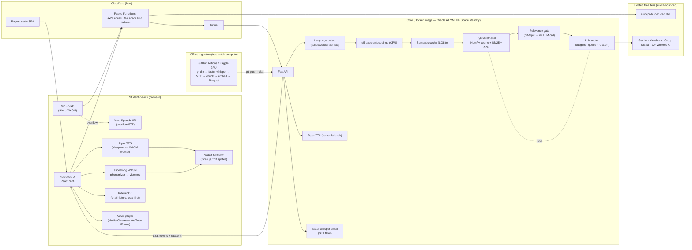
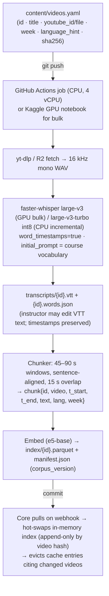

# Adaptive Tutor — Technical Architecture Document

**Status:** v1.0 — awaiting approval before any code is written
**Date:** 2026-09-13
**Audience:** project owner / approver; later, the build team

> **Scope statement (read first).** This system is **language-adaptive** (Egyptian Arabic / English / French, detected per message) and **content-grounded** (answers only from the course's video transcripts). It is **not pedagogically adaptive** — it does not track individual mastery or adjust difficulty per student. That is deliberately out of scope for v1 and listed as a possible Phase 5. Evaluate the architecture against the four criteria below, not against personalization.

The four success criteria, in priority order, and the one-line verdict for each:

| # | Criterion | Verdict | Where it is honestly *not* fully met |
|---|---|---|---|
| 1 | **FAST** | Met. Text-in → first token ≈ 0.75 s p50; voice-in → first spoken audio ≈ 2.2 s p50 (§2.3). | Under an extreme burst the LLM stage queues; degradation is "slightly slower", not failure. |
| 2 | **FREE** | Met at $0/month ongoing. | One potential exception: a DNS name. Use a college subdomain (`tutor.<college>.edu`) → $0; otherwise a domain is ~$10/year. Nothing else costs money. |
| 3 | **SPEAKING AVATAR** | Met: 3D, client-rendered, lip-synced per language, zero server cost per frame (§6). | Egyptian-dialect **voice quality** is the weakest link: the free, unlimited voice reads Egyptian text with a Modern-Standard-Arabic accent. Native-sounding Egyptian TTS that is free *and* unlimited does not exist today (§5.4). |
| 4 | **NO QUOTA** | Met for STT-overflow, retrieval, TTS, avatar, video, hosting (all quota-free by construction). **Not literally guaranteed for LLM generation** — a literal zero-quota guarantee for hosted LLM generation is impossible at $0. Closest achievable guarantee: *no student ever sees a "rate limit" wall* — the system degrades through cache → queue → extractive (LLM-free) answers, never to an error (§4). | LLM generation and live Egyptian STT are the two quota-bounded components; both have unlimited fallbacks that are slower or less polished, not broken. |

Where two criteria genuinely conflict, §8 (risk register) names which one wins and by how much.

---

## 1. Recommended stack

Design rule applied throughout: **anything that scales with the number of students runs on the student's device or on compute we control; hosted free APIs are used only where nothing free is fast enough, and always behind a router with a quota-free floor.**

| Component | Choice | Why chosen (vs. alternatives) | True cost & scaling ceiling | Key risk |
|---|---|---|---|---|
| **Frontend** | Vite + React 19 + TypeScript SPA, deployed on **Cloudflare Pages** (free) | Static SPA is the correct shape (auth-gated app, no SEO, no SSR). Cloudflare Pages: unlimited bandwidth, unlimited requests for static assets, global edge close to Egypt. Next.js/Vercel Hobby was considered: fine technically, but Hobby has a 100 GB/month bandwidth cap and a non-commercial clause; Pages has no bandwidth cap. | $0. Ceiling: effectively none for static. 500 builds/month free. | None material. |
| **Edge layer** | **Cloudflare Pages Functions** (thin): JWT verification, per-student fair-share limit, health-based failover to standby, response caching for cache-hit answers | Keeps the core backend private (reached only via Cloudflare Tunnel) and shields it from bursts and bots with Cloudflare's free WAF / Bot Fight Mode. Kept deliberately thin (Workers free = 100 k req/day, 10 ms CPU/req). | $0. Ceiling: 100 k requests/day ≈ 8× projected peak (≈12 k/day). | Exceeding 10 ms CPU if we transform SSE streams on the edge → we pass streams through untouched. |
| **Core backend** | **FastAPI (Python 3.12) in one Docker image** on **Oracle Cloud Always Free** (Ampere A1, 4 OCPU / 24 GB RAM, ARM64), exposed through **Cloudflare Tunnel** (`cloudflared`, no open ports) | Python because every ML dependency (sentence-transformers, faster-whisper, Piper, espeak-ng phonemizer, Mishkal) is Python-native. Oracle A1 is the only *indefinitely* free VM with real CPU/RAM (AWS free tier is now 6-month credits; Fly/Render/Koyeb free tiers are ≤512 MB or gone). | $0. Ceiling: embedding+retrieval ≈ 60 ms CPU/request → ≈20 req/s sustained; projected burst 1.3 req/s. | Oracle A1 capacity shortages at signup and reclaiming of *idle* instances. Mitigation: warm standby on **Hugging Face Space (free CPU, 2 vCPU/16 GB)** running the *same image*; keep the VM non-idle; Terraform to recreate in <15 min. |
| **Database** | **SQLite** on the VM (roster, usage counters, semantic cache, eval results) + **Litestream** continuous backup to **Cloudflare R2** (10 GB free) | One stateful process, zero ops. 400 users × months of counters is megabytes. D1/Postgres-as-a-service add nothing but a second failure domain. | $0. Ceiling: far beyond scope. | VM loss → restore from R2 (RPO ≈ 10 s). |
| **Vector store** | **In-memory NumPy matrix + BM25 (`bm25s`)** loaded from git-versioned Parquet, hybrid rank fusion | A course is ≈40 h of video ≈ 2–4 k chunks. A 4 k × 768 float16 matrix is 6 MB; brute-force cosine is <2 ms. A vector DB (Vectorize free tier: 30 M queried dims/month ≈ 1 k queries/day at 1024-d) would *add* a quota. | $0. Ceiling: >100 k chunks before brute-force exceeds 20 ms. | None; corpus growth is linear and visible. |
| **Embeddings** | **`intfloat/multilingual-e5-base`** (768-d, 278 M params) on the VM CPU; A/B **`BAAI/bge-m3`** with the eval set | Both are multilingual with Arabic; Egyptian shares most of its vocabulary with MSA so both retrieve dialect acceptably (to be *measured*, §5.3). e5-base ≈ 50 ms/query on 4 ARM cores; bge-m3 ≈ 150 ms, better on Arabic. Hosted embedding APIs all carry quotas. | $0, no quota (our CPU). | Dialect/Arabizi recall — mitigated by hybrid BM25 + transliteration (§5.3), measured by eval set. |
| **LLM** | **Hosted free-tier LLMs behind a budget-aware router** — primary pool: Gemini 2.5 Flash-Lite/Flash, Cerebras (Llama 3.3 70B / Qwen3 32B), Groq (Llama 3.3 70B, Llama 3.1 8B); bulk pool: Mistral Small (Experiment tier: 1 req/s, 1 B tokens/month); trickle: Cloudflare Workers AI (10 k neurons/day). **Plus a zero-LLM extractive floor.** | Justified against the criteria with numbers in §3: self-hosted on free CPU = 25–35 s to first token (fails FAST); in-browser WebLLM = 1–6 s TTFT on laptops and infeasible on phones (fails FAST + coverage); hosted = 0.3–0.9 s TTFT (passes FAST) but is quota-bounded (the NO-QUOTA tension, resolved by cache + gating + router + queue + floor). | $0. Aggregate ceiling ≈ **3 k high-quality answers/day + Mistral bulk lane at 60/min**; projected need after cache/gating ≈ **1.2–1.6 k/day**. Burst capacity ≈ 135 req/min aggregate vs. ≈ 80/min for a whole class in 5 min. | Any provider silently halving its free tier. That is exactly why the extractive floor exists — it has no ceiling. |
| **STT (live voice input)** | Tiered: ① **Groq Whisper-large-v3-turbo** (free: 20 RPM, 2 000 req/day, 8 h audio/day) → ② **Web Speech API** with `ar-EG` / `en-US` / `fr-FR` (unlimited, client-side, Chrome/Edge/Safari/Android) → ③ **self-hosted faster-whisper-small** on the VM (slow lane) → ④ type instead | Egyptian Arabic accuracy is the deciding factor: Whisper large-v3 ≫ Web Speech ar-EG ≫ whisper-small ≫ any in-browser model. In-browser Whisper (small, WebGPU) was evaluated and rejected for Arabic (§5.4). ② is the quota-free overflow; ③ is the browser-independent floor. | $0. ① ≈ 2 000 voice turns/day (≈5 per student); ② unlimited where supported; ③ ≈ 2–4 s per utterance, ≈ 6 concurrent. | Groq free-tier terms/limits changing; Web Speech absent in Firefox. |
| **TTS** | **Piper (VITS) voices run in-browser via sherpa-onnx WASM** (`ar_JO-kareem`, `en_US-lessac`, `fr_FR-siwis`; ≈ 20–60 MB per voice, cached) → fallback **Piper on the VM** for weak devices → last resort **OS `speechSynthesis`** | In-browser = zero server cost per utterance and unlimited by construction; this is what makes 400 simultaneous talking avatars possible. Server Piper alone would cap at ≈ 25 concurrent speakers on 4 cores. Kokoro-82M (in-browser, higher quality) is a Phase-5 upgrade for EN/FR only — it has no Arabic. | $0, no quota. Ceiling: device-bound. | **Egyptian dialect quality** (MSA-accented voice) — see §5.4 and R3. Model download size on mobile data (consent gate). |
| **Video hosting** | **Unlisted YouTube** (or the college's existing host) rendered through a **custom player chrome (Media Chrome, MIT)**; our own transcript-driven caption overlay; **R2 self-hosting** (10 GB) as the alternative when full `<video>` control matters and the corpus fits | Free, unlimited, adaptive bitrate, global CDN. R2 alone cannot hold ≈ 40 h at 720p (≈ 27 GB). The IFrame API supports `seekTo`, `setPlaybackRate`, `controls=0`, so a VLC-like chrome is legitimate. | $0. Ceiling: none. | YouTube ToS forbids hiding branding/obscuring the player; we hide only the default controls, which is the documented `controls=0` mode. |
| **Avatar / lip-sync** | **3D**: Ready-Player-Me-style GLB avatar (Oculus 15-viseme + ARKit blendshapes) self-hosted as a single file, rendered with **three.js** via **TalkingHead.js (MIT)**; visemes driven by **per-language phonemization (espeak-ng → IPA → viseme)**; **2D sprite renderer** behind the same viseme timeline as automatic fallback | Evidence in §6. All rendering is client-side → no server cost, no quota. | $0. Ceiling: none (client-side). | Low-end phones → auto-fallback to 2D; RPM avatar licence (free for apps) — VRoid/VRM is the fully-open alternative with 5 visemes. |
| **Auth** | **Google Sign-In restricted to the college domain** if the college runs Google Workspace / Microsoft 365 (SSO); else **roster-issued enrollment codes** (CSV → one code per student, redeemed once, device-bound JWT) | Gates to the 400 students without any email-sending quota (magic links would hit Resend's 100/day on day one). | $0. | Roster maintenance; handled by an admin page. |
| **Ingestion (offline)** | **GitHub Actions** (free: 2 000 min/month private, unlimited public) running faster-whisper (large-v3-turbo int8, CPU) for incremental clips; **Kaggle/Colab free GPU** for the initial bulk with Whisper large-v3 | Transcription is batch work, so free *batch* GPU is fine here even though free *serving* GPU does not exist. Corpus is git-versioned and diffable. | $0. Ceiling: ≈ 25 h of new video/month on Actions CPU alone; more via Kaggle (30 GPU h/week). | Egyptian ASR WER (§5.2) — mitigated with vocabulary prompting and instructor correction of VTT. |
| **Monitoring** | **Grafana Cloud Free** (Prometheus remote-write, 14-day retention) + **UptimeRobot** (5-min checks) + **Telegram bot** alerts + **Sentry Free** (frontend errors) | All free indefinitely; alerting is the point (§9). | $0. | None. |

**Free-tier numbers above are as of mid-2026 and are the single most volatile input in this document. Phase 4 includes a "re-verify every provider's limits" checklist and the router reads limits from config, not code.**

---

## 2. End-to-end data flow with latency budget

### 2.1 Component map



### 2.2 Sequence: voice in → RAG → streamed text → chunked TTS → lip-synced avatar

Latencies are p50 targets for a student in Cairo, VM in Frankfurt/Jeddah, hosted LLM in EU/US. Each stage's number is the *added* time on the critical path.

```mermaid
sequenceDiagram
  autonumber
  participant S as Student (browser)
  participant E as Edge (CF Functions)
  participant STT as STT (Groq Whisper ▸ Web Speech)
  participant C as Core (FastAPI on VM)
  participant L as LLM router → provider
  participant T as TTS worker (Piper WASM, in-browser)
  participant A as Avatar (three.js)

  Note over S: Tap mic (user gesture → AudioContext unlocked)
  S->>S: Record Opus; Silero VAD detects end-of-speech (+200 ms)
  S->>E: POST /stt (≈40 KB, JWT)
  E->>STT: forward (or client uses Web Speech if Groq budget ≥ 90%)
  STT-->>S: transcript + detected language
  Note over S,STT: STT stage ≈ 600–800 ms (Groq turbo) · Web Speech: interim results live, final ≈ 300 ms

  S->>E: POST /chat {text, history_summary} (SSE)
  E->>E: verify JWT, fair-share counter (+5 ms)
  E->>C: proxy via Tunnel (+60–90 ms RTT)
  C->>C: detect language per message (<1 ms)
  C->>C: embed query e5-base (≈50 ms)
  C->>C: semantic-cache lookup, same language, cos ≥ 0.95 (≈1 ms)
  alt cache hit (target ≥ 40% after warm-up)
    C-->>S: stream cached answer + citations (first token ≈ 150 ms total)
  else miss
    C->>C: hybrid retrieval: cosine + BM25 → RRF → top-6 chunks (≈5 ms)
    C->>C: relevance gate: max fused score < τ_lang?
    alt off-topic / out of corpus
      C-->>S: localized refusal + 3 nearest topics (no LLM call, ≈ 160 ms)
    else grounded
      C->>L: pick provider by remaining budget & language; enqueue if all ≥ 90%
      L-->>C: token stream (TTFT ≈ 300–900 ms; Gemini/Cerebras/Groq fast lane)
      C-->>S: SSE tokens with inline citation markers [[v=3 t=754]]
      Note over C,S: Retrieval stage ≈ 150 ms · First LLM token ≈ 600 ms budget · total text TTFT from send ≈ 750 ms
    end
  end

  S->>S: sentence splitter on token stream (first sentence ≈ 150 ms after TTFT)
  S->>T: synthesize sentence 1 (voice by script run: ar / en / fr)
  T->>T: espeak-ng phonemize → IPA → visemes; Piper synth (≈ 250–400 ms for a 2–3 s sentence on a laptop)
  T-->>S: PCM chunk + viseme timeline scaled to chunk duration
  S->>S: schedule gapless playback on AudioContext clock (+50 ms lead)
  S->>A: speaking state; visemes keyed to audioContext.currentTime
  Note over S,A: First audible word ≈ 2.2 s after end of speech (voice path) · ≈ 1.4 s (text path) · avatar adds 0 ms (renders in lock-step with the audio clock, <16 ms/frame)
  loop each further sentence
    S->>T: synthesize sentence n while sentence n-1 plays (pipelined)
    T-->>S: chunk n
  end
  A->>A: return to idle on last chunk end
  S->>S: persist turn to IndexedDB
```

### 2.3 Latency budget (p50 / p95 targets)

| Stage | p50 | p95 | Notes |
|---|---|---|---|
| End-of-speech detection (client VAD) | 200 ms | 300 ms | Silero VAD WASM; silence hang-over tuned per language (Arabic pauses are longer). |
| STT — Groq Whisper v3-turbo | 600 ms | 1 000 ms | ≈ 40 KB upload + ≈ 300 ms inference for 10 s audio. |
| STT — Web Speech overflow | ≈ 300 ms after end | 800 ms | Streams interim text while speaking → *perceived* latency is near zero. |
| Edge + Tunnel + language detect | 80 ms | 150 ms | RTT Cairo→CF→VM. |
| Embedding + cache check + retrieval + gate | 60 ms | 120 ms | e5-base on 4 ARM cores; brute-force cosine over ≤ 4 k chunks. |
| LLM first token | 600 ms | 1 200 ms | Groq ≈ 0.3–0.5 s, Cerebras ≈ 0.3 s, Gemini Flash-Lite ≈ 0.6–0.9 s, Mistral Small ≈ 0.5–0.8 s. Queue adds visible ETA beyond p95. |
| LLM streaming rate | 100–250 tok/s | — | 200-token answer completes in 1–2 s. |
| First sentence available | +150 ms | +300 ms | ≈ 12 tokens. |
| TTS first chunk (in-browser Piper) | 300 ms | 700 ms | Laptop RTF ≈ 0.15–0.3; mid phone RTF ≈ 0.6–1.0 → server fallback trigger when measured RTF > 0.8. |
| Avatar first viseme | 0 ms | 16 ms | Scheduled on the same AudioContext clock as the chunk. |
| **Text path: send → first token** | **≈ 0.75 s** | 1.5 s | ChatGPT-class. |
| **Text path: send → first audio** | **≈ 1.4 s** | 2.5 s | |
| **Voice path: end of speech → first audio** | **≈ 2.2 s** | 3.5 s | Comparable to ChatGPT voice mode (≈ 1.5–2.5 s). |
| **Cache-hit path (either input)** | ≈ 0.3 s to text, ≈ 0.7 s to audio (text path) | — | Audio for cached answers is synthesized locally on arrival; the text arrives whole. |

---

## 3. Fast + Free: why the hosted-LLM decision is forced

This is the one component where FAST and FREE fight, and it drives the whole NO-QUOTA design, so the evidence goes here.

| LLM option | First-token latency for a 1 500-token RAG prompt | Quality in Egyptian Arabic | Verdict |
|---|---|---|---|
| Self-hosted **Qwen2.5-3B-Instruct Q4_K_M** via llama.cpp on Oracle A1 (4 ARM cores) | Prompt processing ≈ 40–60 tok/s → **≈ 25–35 s** TTFT; ≈ 8–10 tok/s generation; concurrency 1 | Poor (3 B) | Fails FAST by 30×. |
| Self-hosted **Qwen2.5-1.5B** same host | ≈ 150 tok/s prefill → **≈ 10 s** TTFT | Very poor | Fails FAST. |
| Free *serving* GPU (HF ZeroGPU, Colab, Kaggle) | — | — | ZeroGPU requires PRO ($9/mo); Colab/Kaggle prohibit serving and time-limit sessions. No indefinitely free serving GPU exists. |
| **In-browser WebLLM**, Qwen2.5-1.5B q4f16 (≈ 900 MB download) | Intel Iris Xe ≈ 250 tok/s prefill → **≈ 6 s**; Apple M-series ≈ 1 s; phones: out of memory | Very poor | Fails FAST on the median student laptop; unusable on phones. Kept as an optional Phase-5 "offline mode" for capable devices only. |
| **Hosted free tiers** (Gemini Flash-Lite, Cerebras, Groq, Mistral) | **0.3–0.9 s** | Gemini/Llama-70B: good; Mistral Small: moderate | Passes FAST. Quota-bounded → §4. |

Decision: hosted, with FAST prioritized over a literal no-quota guarantee, and the quota tension engineered down to "never a wall" in §4.

---

## 4. The "no-quota-at-400-students" design

### 4.1 Demand model (the arithmetic)

- 400 enrolled; realistic daily actives ≈ 150–250; **≈ 8 questions/student/day** on active days → **≈ 2 000–3 200 questions/day**; finals week ≈ 2×.
- Tokens per LLM call ≈ 1 200 prompt (system + 6 chunks + summary of history) + 250 output ≈ **1 500**.
- Class-session burst: 400 students, 1 question each, within 5 min → **80 req/min ≈ 1.3 req/s**.

### 4.2 Strategy → component coverage

| Component | Primary strategy | Secondary | Quota-free floor | Realistic ceiling once deployed |
|---|---|---|---|---|
| Static app, assets, video | Cloudflare Pages / YouTube CDN | — | itself | none |
| Auth, per-student limits | Edge (free) + VM SQLite | — | itself | none |
| Embedding + retrieval + gating | **Self-hosted** (VM CPU) | HF Space standby | itself | ≈ 20 req/s (15× burst) |
| **LLM generation** | **Semantic cache** (target ≥ 40% hit) + **relevance gate** (≈ 15–25% of traffic never reaches an LLM) + **budget-aware multi-provider router** | **Queue with visible ETA** when every provider ≥ 90% of its window | **Extractive answer**: the top-3 transcript passages with clickable timestamps, in the student's language, phrased "Here is the part of Lecture 3 that covers this" — grounded, useful, zero LLM cost, no ceiling | ≈ 3 k high-quality answers/day + Mistral bulk lane (≈ 60/min sustained, 1 B tokens/month) vs. ≈ 1.2–1.6 k LLM calls/day needed after cache+gate; burst ≈ 135 req/min aggregate vs. 80/min needed |
| **Live STT** | Groq Whisper (2 000/day, 20 RPM) | Web Speech API (unlimited, client-side) | VM faster-whisper-small (slow lane, ≈ 6 concurrent) → typing | ≈ 5 Groq voice turns/student/day; unlimited beyond that where Web Speech exists |
| **TTS** | **Client-side** Piper WASM | Server Piper (≈ 25 concurrent) | OS `speechSynthesis` | none (device-bound) |
| Avatar | **Client-side** 3D | Client-side 2D | — | none |
| Ingestion | GitHub Actions (2 000 min/mo) | Kaggle GPU (30 h/wk) | VM overnight CPU | ≈ 25–40 h new video/month |
| Monitoring | Grafana Cloud free | Telegram alerts | — | none |

### 4.3 The LLM router in detail

- **Budgets as config**: each provider entry has `rpm`, `rpd`, `tpm`, `tpd`, `langs_preferred`, `quality_tier`. Windows tracked in memory (single process) and persisted to SQLite every 10 s.
- **Selection**: language-aware weighted choice among providers under 80% of every window, preferring `quality_tier` A for Arabic (Gemini Flash / Llama-3.3-70B / Qwen3-32B) and the Mistral bulk lane for EN/FR and for overflow.
- **Backpressure**: an `asyncio` queue per lane; when every provider is ≥ 90%, requests get a queue position and ETA streamed as an SSE `status` event ("Busy — about 9 s") and the avatar shows *thinking*. Max wait 20 s, then **floor**.
- **Floor**: extractive answer (no LLM) — always available, always grounded, always cited. Also used when *all* providers error (outage) so the app never shows a red banner.
- **Rotation is a safety net, not the strategy**: one key per provider, on the provider's own free tier, under the provider's terms. No multi-account key farming (it violates every provider's ToS and would be discovered during finals week — the worst possible moment).
- **Fair share**: per-student cap (default 60 messages/day, 6/min; configurable) turns a global quota into a per-person budget, so one abuser or one runaway script cannot exhaust everyone else. Cache hits and extractive answers do not count against it.
- **Cache pre-warming**: after ingestion, generate 10 anticipated questions per video per language overnight through the Mistral lane (≈ 40 videos × 3 × 10 = 1 200 calls, spread across nights). These become cache entries *and* the seed of the eval set after human review.

### 4.4 Cost-of-failure honesty

If Mistral and Gemini both halved their free tiers tomorrow, the system would still answer every question: ≈ 60% from cache/gate, ≈ 30% via the remaining providers with queueing, ≈ 10% extractive. Nobody hits a wall; the tail gets less polished. The escape hatch, if the college ever chooses to spend money, is a single paid LLM key (≈ $3–8/month at this volume) — a config change, not an architecture change.

---

## 5. Video → transcript RAG pipeline and Egyptian Arabic plan

### 5.1 Ingestion pipeline (free, incremental)



- **Free transcript generation**: Whisper large-v3 on Kaggle (30 GPU h/week; ≈ 6 min per hour of audio on a T4 with faster-whisper) for the initial bulk; large-v3-turbo int8 on GitHub Actions CPU (≈ 0.5–1× realtime) for clips added during the term. Both paths run the same script.
- **Incremental, no full re-index**: each video is its own Parquet shard keyed by content hash. Adding a clip = one shard appended; editing a transcript = one shard replaced; the in-memory matrix is rebuilt from shards in ≈ 50 ms. BM25 index likewise.
- **Timestamps as first-class data**: every chunk carries `t_start/t_end`; the LLM is given chunks labelled `[Lecture 3 · 12:34–13:50]` and must cite with `[[v=3 t=754]]`, which the client renders as a chip → `player.seekTo(754)` + highlighted caption line. Answers with no citation are flagged in eval.
- **Captions for free**: the same VTT is the caption track (own `<video>`) or our synced overlay (YouTube IFrame, polled at 250 ms).

### 5.2 Egyptian Arabic transcription quality (offline)

Plain Whisper large-v3 on Egyptian dialect is materially worse than on MSA (published WERs on Egyptian broadcast/conversational sets are roughly 30–50% vs. ≈ 15–20% for MSA). Mitigations, in order of payoff:

1. `initial_prompt` seeded with the course's technical vocabulary (in both scripts) — the single cheapest WER win for jargon.
2. Evaluate 2–3 community Egyptian fine-tunes of Whisper from Hugging Face against a 20-minute hand-corrected sample **before** bulk transcription; pick by WER.
3. Instructor/TA correction pass on VTT text (timestamps untouched), prioritised by retrieval-frequency after launch.
4. RAG is tolerant of moderate WER: semantic embeddings still retrieve the right passage, and the *timestamp* is what the student ultimately uses.

### 5.3 Language handling per message

| Step | Method | Cost |
|---|---|---|
| Script check | Arabic-script character ratio > 30% → Arabic; respond in **Egyptian Arabic** (prompt: "عامية مصرية، مش فصحى"; avoid tashkeel in text output) | µs |
| Arabizi (Latin-script Arabic) | Heuristic classifier: digits-in-words (`3`, `7`, `2`, `5`, `9`) + a ≈ 250-word Egyptian function-word lexicon (`ezay`, `leh`, `kda`, `ana`, `enta`, `mesh`, `3ayez`…) → `arabizi` | µs |
| EN vs FR | fastText `lid.176` (on the VM) for ≥ 4 words; lexicon for shorter; tie → previous message's language | < 1 ms |
| Code-switching (Arabic sentence with English terms) | Dominant script decides response language; technical terms stay in Latin script inside Arabic answers (as Egyptian speakers do); TTS splits by script runs and voices each run with the matching Piper model | — |
| Arabizi retrieval | Embed **both** the raw Arabizi and a rule-based transliteration to Arabic script; union results before RRF. Answer in Arabic script by default (readable, TTS-able) with a per-student toggle "reply in Arabizi" | +50 ms |
| Embedding dialect support | e5-base / bge-m3 are MSA-heavy but Egyptian shares most tokens; BM25 catches dialect-specific and exact-term matches; **eval set per language sets the relevance-gate threshold τ_lang separately** | — |

### 5.4 Live STT and TTS quality mitigation

**STT (Egyptian)** — ranked by measured accuracy on Egyptian speech: Whisper large-v3(-turbo) hosted on Groq (best) → Web Speech `ar-EG` (Google's model; decent for short questions) → faster-whisper-small on VM (poor for dialect; acceptable as floor) → in-browser whisper-small WebGPU (rejected: same poor Egyptian accuracy *plus* a 250 MB download *plus* no phones). Groq also auto-detects language per utterance, which is what per-message detection needs; Web Speech needs a locale, so it is opened with the language of the student's last message and a one-tap language switch on the mic button.

**TTS — the plain statement.** No open-weight, CPU-fast TTS model today produces a *native Egyptian* voice. Piper's Arabic voice (`ar_JO-kareem`) is MSA-accented; reading Egyptian text it is intelligible but sounds like a newsreader reading a WhatsApp message. Vowelisation matters: undiacritised Arabic gets mis-vowelled, so text is passed through **Mishkal** (rule-based diacritiser, free) before phonemization, with an LLM instruction to prefer TTS-friendly Egyptian. Closest achievable guarantee: unlimited, free, ≈ 300 ms-first-chunk Arabic speech that is understandable; not native-sounding. The upgrade path that keeps FREE and NO-QUOTA is **fine-tuning a Piper voice on 1–2 h of recorded Egyptian speech** (a volunteer native speaker; Kaggle GPU; Piper's training recipe) — Phase 5. The paid alternative (Azure `ar-EG-SalmaNeural`, F0 = 500 k chars/month) is a *quota* and would cover ≈ 1 600 answers/month — noted, not recommended.

**French**: Piper `fr_FR-siwis`/`upmc` medium is clear with slightly flat prosody; Kokoro's French voice (in-browser, Phase 5) is a clear step up. **English**: Piper `en_US-lessac` medium is good; Kokoro better. Risk is low-to-moderate for both.

**Mobile audio autoplay** — see §7.4; it is a design constraint, not an afterthought.

---

## 6. Avatar: 3D vs 2D decision, and per-language visemes

### 6.1 Decision: 3D primary, 2D automatic fallback — same viseme engine

| Criterion | 3D (three.js + TalkingHead.js + GLB) | 2D (sprite/SVG mouth shapes) |
|---|---|---|
| FAST | Client-side; 1 skinned mesh ≈ 30 k tris + 52 morph targets → 60 fps on integrated GPUs, ≈ 30 fps on 2019-era mid phones; 0 ms added to speech latency | Trivial; 60 fps everywhere |
| FREE | three.js (MIT), TalkingHead.js (MIT), avatar GLB self-hosted (RPM: free for apps; VRoid/VRM: fully free) ≈ 3–5 MB once, cached | Free |
| NO QUOTA | No per-frame or per-request server cost; no third-party runtime calls (the GLB is a static file) | Same |
| Language fidelity | Oculus 15-viseme set covers Arabic pharyngeals/emphatics approximately and French rounded/nasal vowels well | 9–12 Preston-Blair shapes; adequate |

3D clears all three simultaneously **because rendering is on the student's device and the avatar is a static asset** — the only way 3D would fail is a server-rendered avatar (D-ID/HeyGen-style), which fails FREE and NO-QUOTA immediately and was never on the table. Fallback to 2D triggers automatically on: WebGL context failure, `prefers-reduced-motion`, `navigator.deviceMemory ≤ 2`, or measured fps < 20 for 3 s. Both renderers consume the identical viseme timeline, so lip-sync logic is written once.

Evidence: TalkingHead.js drives Ready-Player-Me GLBs with Oculus visemes and pluggable per-language lip-sync modules, includes idle/blink/head-motion/mood animation, and runs at 60 fps in-browser in its public demos; three.js gzipped core ≈ 170 KB; a draco-compressed RPM half-body GLB is ≈ 2–4 MB.

### 6.2 Per-language viseme mapping (phoneme-driven, not waveform-driven)

The lip-sync is derived from **text**, which is why it adapts per language and works with any TTS source (in-browser Piper, server Piper, OS voice):

1. **Phonemize per language** with espeak-ng (`ar`, `en-us`, `fr-fr`) → IPA. Egyptian specifics: ج → /g/ (not /dʒ/), ق → /ʔ/ in most words, ث → /s/ or /t/ — handled by a small Egyptian rewrite table applied to the IPA before mapping.
2. **IPA → Oculus viseme** via one language-independent table (IPA is universal): bilabials /b m/ → `PP`; labiodentals /f v/ → `FF`; dental /θ ð/ → `TH`; alveolar /t d n l/ → `DD`/`nn`; velar/uvular /k g q x ɣ/ → `kk`; pharyngeals /ħ ʕ/ and glottal /h ʔ/ → open-throat variant of `aa` with reduced jaw; emphatics /sˤ dˤ tˤ ðˤ/ → `SS`/`DD` with wider mouth; sibilants → `SS`/`CH`; vowels → `aa` `E` `I` `O` `U`; French front-rounded /y ø œ/ and nasals /ɑ̃ ɛ̃ ɔ̃/ → `U`/`O` with a nasal flag that lowers jaw amplitude.
3. **Timing**: each phoneme gets a base duration from a per-language table (Arabic long vowels and geminates doubled; French nasals lengthened); the sequence is **scaled to the actual audio chunk duration** so drift is bounded within one sentence (≤ 3 s) and re-anchored at every chunk boundary. Target drift < 100 ms.
4. **Precision upgrade (Phase 3.5)**: re-export the Piper VITS ONNX to also output its internal duration tensor, giving exact per-phoneme durations at zero extra compute. For OS `speechSynthesis`, `onboundary` word events (Chrome/Edge) re-anchor timing per word.
5. Co-articulation: visemes are blended (attack 40 ms, release 80 ms) rather than switched, with a per-language jaw-amplitude curve.

### 6.3 Avatar states

| State | Trigger | Behaviour |
|---|---|---|
| **Idle** | No activity | Breathing, blink every 3–6 s, micro head sway, occasional glance at camera |
| **Listening** | Mic active (VAD open) | Head tilts toward camera, eyebrows slightly raised, mouth closed, pulsing ring on the mic; caption of interim STT shown |
| **Thinking** | Retrieval/LLM in flight (and queue wait) | Eyes up-left, slow nod; status text "reading Lecture 3…" from the retrieval result |
| **Speaking** | First audio chunk scheduled | Visemes on the audio clock, head nods on sentence stress, blinks suppressed at word onsets; current sentence highlighted in the bubble |
| **Muted / Offline** | Audio not unlocked (iOS) or core unreachable | Neutral pose with a tappable "🔈 tap to enable voice" / "offline" badge; text still streams |

Accessibility: the avatar region is `role="img"` with an `aria-label` that updates with the state ("Tutor avatar: speaking"); it never carries information that is not also in the transcript.

---

## 7. Layout, notebook theme, responsive/RTL reflow, mobile audio

### 7.1 Grid

```css
.app {
  display: grid;
  min-height: 100dvh;
  grid-template-columns: minmax(280px, 1fr) minmax(0, 2fr);
  grid-template-rows: clamp(220px, 38vh, 420px) minmax(0, 1fr);
  grid-template-areas:
    "avatar video"
    "chat   chat";
}
@media (max-width: 1024px) { /* tablet */
  .app { grid-template-columns: 1fr 2fr; grid-template-rows: 200px 1fr; }
}
@media (max-width: 767px) { /* phone */
  .app {
    grid-template-columns: 1fr;
    grid-template-rows: auto minmax(0, 1fr) auto;
    grid-template-areas: "top" "chat" "composer";
  }
  .top { display: flex; align-items: center; gap: 12px; position: sticky; top: 0; }
  .avatar { inline-size: 88px; block-size: 88px; border-radius: 50%; } /* compact bust */
  .video  { flex: 1; aspect-ratio: 16/9; }               /* collapsible sheet */
  .composer { padding-block-end: env(safe-area-inset-bottom); }
}
```

Grid areas are named, so RTL flips column *order* automatically (`direction: rtl` on the root swaps the visual columns: avatar top-right, video top-left) with zero extra CSS.

### 7.2 Notebook theme tokens

- Paper `--paper:#fdfcf7`, ink `--ink:#1f2933` (contrast 14.6:1), rule `--rule:#d9e2ec`, margin line `--margin:#f4a3a8`, accent `--accent:#2563eb` (4.5:1 on paper for text; buttons use `--accent-ink` on a darker shade). Dark mode = "blackboard": `--paper:#141a1f`, `--ink:#e6edf3`, ruled lines at 12% alpha.
- Ruled lines: `background-image: repeating-linear-gradient(transparent 0 calc(var(--lh) - 1px), var(--rule) calc(var(--lh) - 1px) var(--lh)); background-attachment: local;` on the chat scroller so lines scroll with the content, `--lh` equals the body line-height (28 px) so text sits on the lines. Red margin: `border-inline-start: 2px solid var(--margin)` at `padding-inline-start: 56px` — logical properties flip it to the right in RTL.
- Type: headings in a handwritten face (Caveat / Patrick Hand), body Inter; Arabic body in **Cairo** or IBM Plex Sans Arabic (larger x-height, tuned line-height 1.9 for Arabic to keep it on the rules); French uses Inter. Loaded from Google Fonts with system fallbacks.
- Message bubbles are "sticky notes" with a subtle paper shadow; citations are yellow-highlighter chips `▶ Lecture 3 · 12:34`.

### 7.3 RTL, accessibility, states

- **RTL throughout**: root `dir` follows the UI language; each bubble gets `dir="auto"` + `unicode-bidi: plaintext` so mixed Arabic/English lines render correctly; timestamps, code, and numbers are wrapped in `<bdi dir="ltr">`; icons that imply direction (send arrow, skip ±10 s) mirror with `[dir=rtl] .icon-dir { transform: scaleX(-1); }`; all spacing uses logical properties; the composer's mic/send order flips; caret and scrollbar behave natively.
- **WCAG AA**: colour tokens verified ≥ 4.5:1; visible focus rings; full keyboard control of the player (Space/K, J/L ±10 s, `,`/`.` speed, C captions, M mute), chat (Enter send, Shift+Enter newline, ↑ edit last), and citations (buttons, not links); streaming answers announced via `aria-live="polite"` at **sentence** granularity (token-level would spam screen readers); avatar and video regions labelled; captions from the transcript VTT; a "text-only, no motion" mode.
- **Local-first history**: Dexie/IndexedDB keyed by student; conversations, citations and the last-played timestamp survive reloads; the server stores no conversation text (privacy + zero DB growth); export to Markdown.
- **Loading/streaming states**: composer shows "listening…" with live interim text; after send, a skeleton bubble with the retrieval status ("reading Lecture 3, 12:34…"), then tokens; a queue banner with countdown if the router is backpressured; chunk-by-chunk highlighted sentence during speech; a discreet "⚡ from cache" tag; extractive answers clearly labelled "Straight from the lecture".

### 7.4 Mobile audio autoplay fix (iOS Safari, Android Chrome)

Browsers block audio that is not started inside a user gesture; iOS additionally suspends `AudioContext` on backgrounding and mutes Web Audio under the ringer switch in some configurations. Design:

1. A single `AudioContext` is created **and resumed inside the first tap** (the Send or Mic button — the first message is always a gesture — or the one-time "Enable voice & avatar" onboarding card that also asks consent to download voice models). A 1-frame silent buffer is played to unlock, and a looping silent `<audio>` element is started once to promote the iOS audio session to *playback* so the ringer switch does not mute it.
2. All speech is scheduled on that one context with `AudioBufferSourceNode`s (gapless, sample-accurate; visemes use `audioContext.currentTime`). Never `new Audio(url).play()` per chunk.
3. `visibilitychange` → `audioContext.resume()`; if `state !== 'running'`, the avatar enters *Muted* with a "tap to enable voice" badge; text keeps streaming, nothing breaks silently.
4. Reload with history: no auto-read; a play button per message.
5. `speechSynthesis` (the last-resort voice) is also only invoked from within a gesture-initiated chain.

---

## 8. Risk register — where the four criteria collide

| ID | Tension | Resolution (which wins, quantified) |
|---|---|---|
| **R1** | **FAST vs FREE — LLM.** Free CPU LLM ≈ 25–35 s TTFT; free serving GPU does not exist. | FAST wins: hosted free tiers (0.3–0.9 s). Cost: quota exposure, handled in R2. |
| **R2** | **FREE vs NO QUOTA — LLM.** Aggregate free ceiling ≈ 3 k quality answers/day + Mistral bulk; demand ≈ 2–3 k questions/day raw. | NO QUOTA reframed to "never a wall": cache (≥ 40%) + gate (15–25%) cut LLM calls to ≈ 1.2–1.6 k/day; router + queue absorb bursts (135 vs 80 req/min); extractive floor is unlimited. Residual: a provider policy change degrades polish for the tail, not availability. |
| **R3** | **SPEAKING AVATAR vs FREE — Egyptian voice quality.** No free, unlimited native-Egyptian neural voice exists. | FREE + NO QUOTA win: Piper MSA-accented Arabic (intelligible, ≈ 300 ms first chunk, unlimited). Quantified gap: accent, not comprehension. Closure path: custom Egyptian Piper voice (Phase 5, still free). |
| **R4** | **FAST vs SPEAKING AVATAR — TTS on low-end phones.** In-browser Piper RTF ≈ 1.0 on weak phones → +1–2 s to first audio. | FAST wins per device: measured RTF > 0.8 on the first chunk → switch that device to server Piper (≈ 25 concurrent) → OS voice. Text is never delayed by audio. |
| **R5** | **NO QUOTA vs Egyptian STT accuracy.** Best Egyptian STT (Whisper large-v3 on Groq) is quota-bounded at 2 000/day; the unlimited options are less accurate. | Accuracy first within budget (≈ 5 voice turns/student/day), then Web Speech `ar-EG` overflow (unlimited), then VM whisper-small (slow), then typing. Nobody is blocked; the tail is less accurate. |
| **R6** | **FREE vs reliability — Oracle A1.** Capacity at signup; reclaim of idle instances. | Same Docker image on an HF Space standby with edge failover (health check every 30 s); VM kept non-idle; Litestream backups; Terraform re-creation < 15 min. Accept: a few minutes of degraded (standby is 2 vCPU: retrieval p50 ≈ 120 ms instead of 60 ms). |
| **R7** | **FAST vs grounding precision.** A cross-encoder reranker would raise citation precision but costs ≈ 200 ms CPU per query. | FAST wins in v1: hybrid cosine + BM25 + RRF; the eval set decides in Phase 4 whether a reranker earns its 200 ms (only if recall@5 < 0.85). |
| **R8** | **NO QUOTA vs access.** Open link = trivially exhausted by non-students. | Gate to the roster (SSO or enrollment codes) + per-student fair-share caps. Cost: a one-time enrollment step. |
| **R9** | **FREE vs terms of service.** Free tiers are for evaluation/non-commercial use; Mistral's Experiment tier may use prompts for training; YouTube limits player modifications. | Documented per provider; college sign-off required before launch; no key farming; prompts contain course text and student questions only (no PII beyond the JWT subject); `controls=0` is YouTube's documented mode. |
| **R10** | **FAST vs mobile data.** Voice models 20–60 MB per language, avatar 3–5 MB. | Consent card on first voice use, Wi-Fi hint, lazy per-language load, Cache Storage persistence; server TTS while downloading so the first answer still speaks. |
| **R11** | **Egyptian ASR WER (offline transcripts) vs answer quality.** | Vocabulary prompting, fine-tune evaluation, instructor VTT corrections prioritised by retrieval frequency; eval set tracks citation accuracy. |

---

## 9. Guardrails that protect FREE and NO QUOTA

- **Access control**: recommended = college SSO restricted to the college domain (Google Workspace `hd=` claim or Microsoft tenant), because it is free, unlimited, and needs no roster upkeep; fallback = roster CSV → one-time enrollment codes → device-bound JWT (30-day, refreshable). Admin routes sit behind Cloudflare Access (free ≤ 50 users).
- **On-topic by construction (cheap)**: ① the **relevance gate** — no LLM call unless retrieval finds a passage above τ_lang (off-topic and most jailbreak attempts fail here at zero cost); ② input cap 800 characters, history summarised rather than replayed; ③ system prompt: answer only from the provided passages, cite every claim, otherwise use the fixed refusal template in the student's language; ④ output post-check: an answer without a citation on a gated-in question is replaced by the extractive answer; ⑤ per-student fair-share caps (60/day, 6/min) bound any single actor's burn.
- **Out-of-corpus behaviour (explicit)**: localized refusal — Arabic: «السؤال ده مش من مادة الكورس. أقرب مواضيع عندي: …», English/French equivalents — plus the three nearest lecture topics as citation chips; partial coverage → answer the covered part and state what is not covered.
- **Monitoring/alerting (free)**: Prometheus metrics from the core (`provider_budget_used_ratio`, `queue_wait_seconds`, `cache_hit_ratio`, `retrieval_latency`, `stt_budget_used_ratio`, `vm_load`, `disk_used`) → Grafana Cloud Free dashboards; alert rules → Telegram: any LLM/STT provider > 70% of its daily window before 14:00; queue p95 > 5 s for 5 min; cache hit < 25% for a day; VM load > 3.0 or disk > 80%; standby failover triggered. UptimeRobot on `/healthz`. Sentry Free for frontend exceptions.
- **Eval set before students see it**: `eval/qa_{ar,en,fr}.jsonl` — 40 grounded Q&A per language (gold video + timestamp window + key facts), 20 off-topic per language (must refuse), 10 Arabizi, 10 code-switched. Metrics: retrieval recall@5 ≥ 0.85, citation within ±30 s ≥ 0.8, refusal precision ≥ 0.95, response-language match ≥ 0.98, Egyptian-vs-MSA marker check on Arabic answers. Runs in GitHub Actions on every corpus/prompt change and gates deploy.

---

## 10. Phased build roadmap

| Phase | Scope | Exit criteria (measured) |
|---|---|---|
| **0 — Foundations** (week 1) | Accounts: Cloudflare, Oracle (or HF Space), GitHub, provider keys. Ingest all videos (Kaggle GPU, large-v3), instructor spot-check, chunk + embed, corpus in git. Draft eval set (seeded by pre-warm questions, human-reviewed). Repo scaffold, Docker image, Terraform for the VM. | Corpus indexed; eval set exists; `/healthz` green on VM and standby. |
| **1 — Static layout + text-only RAG chat** (weeks 2–3) | Notebook 3-panel UI, RTL, custom video player with citation jump + transcript captions, auth, language detection (incl. Arabizi), hybrid retrieval, relevance gate + refusal, LLM router (no queue yet), SSE streaming with citation chips, local-first history, loading states. | recall@5 ≥ 0.85; refusal precision ≥ 0.95; text TTFT p50 < 1 s; RTL and keyboard audit pass; WCAG AA contrast pass. |
| **2 — Voice I/O** (weeks 4–5) | VAD + tiered STT, sentence splitter, in-browser Piper (sherpa-onnx) with server fallback and OS voice, gapless AudioContext playback, iOS unlock flow, script-run voice switching, Mishkal diacritisation, karaoke highlight. | end-of-speech → first audio p50 < 2.5 s (laptop), < 3.5 s (mid phone); works on iOS Safari with ringer on silent; no autoplay failures in the test matrix. |
| **3 — Avatar lip-sync** (weeks 6–7) | GLB avatar + three.js/TalkingHead; espeak-ng phonemizer (ar/en/fr) → visemes → timeline scaled to chunk; states (idle/listening/thinking/speaking/muted); 2D fallback + auto-switch; reduced-motion. Phase 3.5: Piper duration-tensor export for exact timing. | 60 fps desktop / ≥ 30 fps mid phone; lip-sync drift < 100 ms per sentence; automatic 2D fallback verified; screen-reader labels pass. |
| **4 — Scale-hardening to 400** (weeks 8–9) | Semantic cache + pre-warm, router budgets from config, queue with ETA, extractive floor, per-student fair-share, standby failover drill, Grafana/Telegram alerts, k6 load test (400 virtual users, 5-minute burst), ToS review + college sign-off, free-tier limit re-verification checklist. | 400-VU burst: 0 errors, p95 text TTFT < 3 s incl. queue, cache hit ≥ 40% on replayed eval traffic; failover < 60 s; alerts fire in drill. |
| **5 — Later / optional** | Custom Egyptian Piper voice (recorded volunteer, Kaggle fine-tune); Kokoro for EN/FR; cross-encoder reranker if recall demands it; WebLLM offline mode for capable devices; **pedagogical personalisation** (mastery tracking, difficulty adaptation) — explicitly out of v1 scope. | Per item. |

Each phase is independently approvable and shippable; Phase 1 alone is a usable text tutor.

---

## Appendix A — Assumptions to confirm before Phase 0

1. Approximate corpus size (hours of video) and whether it already lives on YouTube/Drive/an LMS.
2. Whether the college provides Google Workspace or Microsoft 365 accounts (decides SSO vs codes).
3. Whether a `tutor.<college>.edu` subdomain can be delegated to Cloudflare (decides the only possible non-zero cost).
4. Lecture language mix (Egyptian Arabic with English terms is assumed) — affects the Whisper prompt and eval set.
5. Acceptability of the free-tier terms of each provider to the college (R9).
